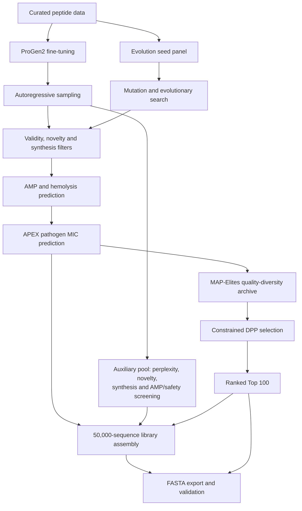

# AMP Challenge

An antimicrobial peptide design pipeline combining a fine-tuned **ProGen2** language model
with **evolutionary search**. Candidates are screened for sequence validity, novelty and
synthesizability, scored for predicted activity and safety, and selected for diversity.

The submission contains **50,000 unique peptide sequences** and a **ranked Top 100** drawn
from that library. This repository provides the submitted artifacts, model inference code,
checkpoint access, and reproducibility evidence.

[Quick start](#quick-start) · [Method](#how-it-works) · [Model weights](https://github.com/RishyanthReddy/amp-challenge-public/releases/tag/progen2-checkpoint-20260928) · [Documentation](docs/README.md) · [Data sources](docs/DATA_ACCESS.md)

## Quick start

Requirements: Git and [uv](https://docs.astral.sh/uv/). Export and validation run on CPU; no GPU or model download is needed.

```bash
git clone https://github.com/RishyanthReddy/amp-challenge-public.git
cd amp-challenge-public
uv sync --frozen --python 3.12
uv run generate
uv run python scripts/verify_submission.py .
```

| Output | Contents |
| --- | --- |
| [`generate/library.fasta`](generate/library.fasta) | 50,000 unique sequences |
| [`generate/top.fasta`](generate/top.fasta) | 100 candidates in rank order; a subset of the library |

`uv run generate` deterministically exports the frozen, selected tables. It does **not**
retrain models or sample a new library. The same files are mirrored in
`generate_broad_spectrum/` for compatibility. See [execution guide](docs/running.md) for
model inference, training, scoring, and selection commands.

## How it works



- **Generation:** ProGen2 samples new sequences; evolutionary search explores mutations
  while recording parent-child ancestry.
- **Evaluation:** sequence descriptors feed AMP and empirical human-erythrocyte hemolysis
  models. The APEX ensemble predicts MIC across 11 pathogens for eligible ranked candidates.
- **Selection:** MAP-Elites covers charge, hydrophobic moment and length; constrained DPP
  selection balances predicted quality and sequence diversity, with a nested Top 50.
- **Assembly:** 3,964 scored candidates and 46,036 screened ProGen2 auxiliary sequences form
  the submitted library. Auxiliary sequences do not have APEX predictions.

The submitted Top 100 contains 60 autoregressive and 40 evolutionary candidates. HydrAMP
and diffusion implementations are retained as research baselines; their generated sequences
are excluded from this entry. Read the [method](docs/method.md) or [abstract](docs/FINAL_METHOD_ABSTRACT.md).

## Run model inference

Install [GitHub CLI](https://cli.github.com/) (the CLI may require login), then:

```bash
uv run python cloud/fetch_progen_checkpoint.py
uv run --project autoregressive-models --locked python \
  autoregressive-models/scripts/06_generate_from_checkpoint.py \
  --checkpoint autoregressive-models/checkpoints/progen2_small_amp_best_val \
  --n 100 --seed 42 --max-perplexity 100 \
  --output-dir outputs/inference_example
```

The fetcher downloads the public release assets and verifies their sizes and SHA-256 hashes.
Sampling uses CUDA when available and otherwise CPU. These are new research candidates;
this command does not replace the submitted FASTAs. See [model assets](docs/assets.md).

## Repository structure

```text
src/amp_challenge_2027/   Submission export entry point
scripts/                  Validation, provenance and artifact assembly
cloud/                    Beam runners and checkpoint downloads
data-engineering/         Data curation and biophysical descriptors
autoregressive-models/    ProGen2 training and inference
evolutionary-search/      Mutation search and ancestry tracking
shared-evaluator/         Activity, hemolysis and pathogen scoring
portfolio-selection/      Diversity selection and frozen output tables
generate/                 Canonical submission FASTAs
generate_broad_spectrum/  Compatibility copy of the FASTAs
diffusion-models/         Research baseline and shared APEX assets
vae-latent-models/        HydrAMP research baseline
docs/                     Usage, methods, data and verification
```

Each component has its own dependency lockfile where its runtime differs from the root
export environment. Paths are retained so that recorded provenance hashes and model loading
remain valid.

## Validation and reproducibility

| Check | Result |
| --- | --- |
| Library / Top 100 | 50,000 / 100 unique sequences |
| Top 100 contained in library | Yes |
| Exact library matches to 39,448 reference sequences | 0 |
| Maximum Top-100/reference Levenshtein ratio | 0.8000 |
| Maximum internal Top-100 Levenshtein ratio | 0.7778 |
| Repeated submission export | Byte-identical |
| Historical training / selection replay | Recorded in the linked verification report |

A separate fresh 50,000-sequence build also passed the sequence checks. Exact regeneration
of every historical auxiliary filler was not tested. See the
[verification report](docs/FULL_REPLAY_VERIFICATION.md) and
[artifact hashes](docs/FINAL_HANDOFF_MANIFEST.json).

## Reproducibility scope

The public repository supports deterministic export of the submitted artifacts and ProGen2
inference with the released checkpoint. Full training and evaluation require additional
curated training tables and AMP/RBC model assets that are not bundled here. Historical
source acquisition gaps are documented in the [training disclosure](docs/PUBLIC_TRAINING_DISCLOSURE.md).
See [release scope](PUBLIC_RELEASE_STATUS.md) for the remaining limitations.

## Data and interpretation

Activity, hemolysis and MIC are **predictions**, not experimental measurements of these
candidates. No generated peptide has been assayed by this project. The empirical hemolysis
model uses 183 peptides and achieved grouped out-of-fold ROC-AUC 0.7280; prospective
performance is unknown.

Training sources, filters and limitations are documented in the
[data card](data-engineering/data/DATA_CARD.md), [source inventory](docs/training_source_scope.json),
and [model cards](shared-evaluator/reports/model_cards.md). Source access and historical limitations are recorded in the
[training disclosure](docs/PUBLIC_TRAINING_DISCLOSURE.md).

## License

Original project code is provided under the [MIT license](LICENSE). Third-party code,
model weights and datasets retain their own terms; see [assets and attribution](docs/assets.md).

## Training-source access

See [source retrieval and snapshot details](docs/DATA_ACCESS.md). Raw third-party databases are not mirrored, except the exact AMPlify training FASTA distributed with its verified CC BY 4.0 attribution. Known historical access gaps are disclosed explicitly.
