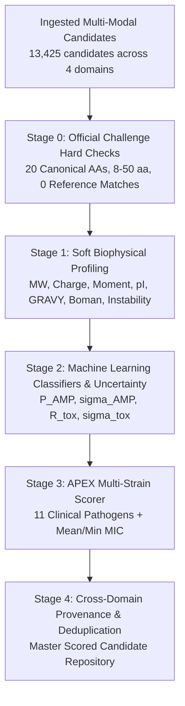

# Role 06: Shared Evaluator Pipeline v1.0 Specification & Interface Contract

**Date:** 2026-09-27  
**Version:** 1.0.0 (FROZEN)  
**Author:** Shared Evaluator & Integration Team  

---

## 1. Staged Evaluator Architecture

### Stage 0: Hard Invalidation Gate
- **Alphabet:** Strictly 20 standard proteinogenic amino acids (`ACDEFGHIKLMNPQRSTVWY`).
- **Length:** Strictly 8 to 50 residues ($8 \le L \le 50$).
- **Challenge Overlap:** Exact match against `antibacterial.fasta` (39,448 sequences). Any exact match is quarantined.
- **Rule:** Only official invalidities trigger hard rejection; unusual biophysical properties remain soft evidence.

### Stage 1: Soft Biophysical Profile
- Computes: `length`, `molecular_weight_da`, `net_charge_ph7`, `isoelectric_point`, `eisenberg_moment`, `gravy`, `boman_index`, `instability_index`, amino acid fractions.

### Stage 2: Activity & Safety Predictors (Leakage-Aware Ensemble)
- **AMP Likelihood ($P_{\text{AMP}}$):** Random Forest ensemble trained on leakage-aware cluster splits (`val_auc = 0.9681`, `test_auc = 0.9620`).
- **AMP Uncertainty ($\sigma_{\text{AMP}}$):** Tree-to-tree standard deviation.
- **Toxicity / Hemolysis Risk ($R_{\text{tox}}$):** Random Forest ensemble estimating hemolytic potential.
- **Toxicity Uncertainty ($\sigma_{\text{tox}}$):** Standard deviation across ensemble estimators.

### Stage 3: APEX Multi-Strain Pathogen Scoring
- Evaluates the 8-model APEX pathogen ensemble against the 11 clinical pathogens:
  * *A. baumannii* ATCC 19606
  * *E. coli* ATCC 11775, AIC221, AIC222
  * *K. pneumoniae* ATCC 13883
  * *P. aeruginosa* PA01, PA14
  * *S. aureus* ATCC 12600, BAA-1556 (MRSA)
  * *E. faecalis* ATCC 700802 (VRE), *E. faecium* ATCC 700221 (VRE)
- Outputs individual predicted MICs in $\mu$M, `apex_mean_mic`, and `apex_min_mic`.

### Stage 4: Cross-Domain Provenance & Deduplication
- Identifies identical sequences generated across multiple domains.
- Maps `contributing_domains`, `contributing_candidate_ids`, `contributing_models`, and `domain_count`.

---

## 2. Policy Directives
1. **Score Broadly, Filter Narrowly:** No sequence is hard-dropped due to an imperfect ML prediction. All predictions and biophysical properties remain visible as separate columns.
2. **Missing Safety Policy:** Missing hemolysis or toxicity data is strictly **unknown**, never treated or imputed as safe.
3. **Novelty Verification:** Sequences destined for the ranked Top-100 pool must have exact RapidFuzz Indel similarity $\le 0.80$ to all 39,448 reference sequences.
